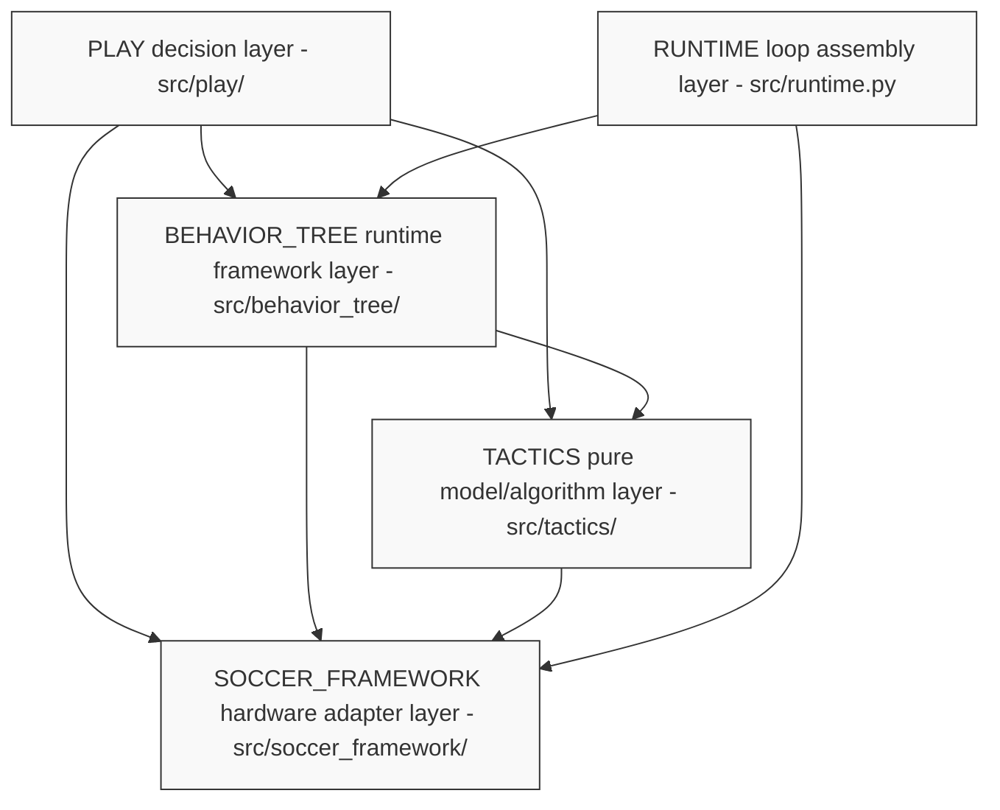
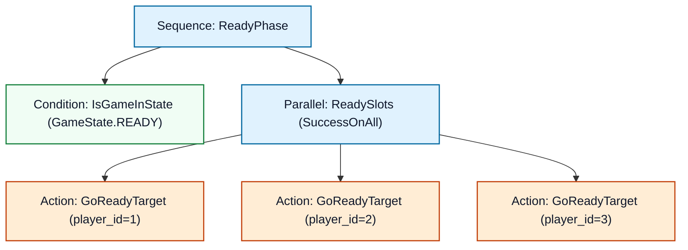
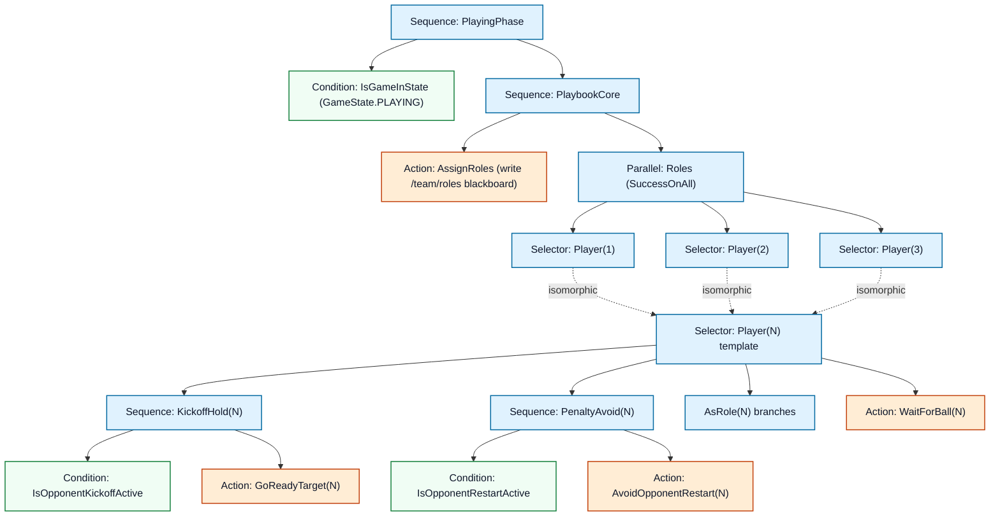

# Detailed Behavior Tree Structure

This document systematically organizes and diagrams the architecture, directory
responsibilities, blackboard data flow, and complete `py_trees` behavior tree in
this project. It is intended as a technical reference for future strategy
development, debugging, and extension.

---

## 1. Project Directory Structure and Module Responsibilities

This project follows **one-way dependencies** and **model/execution separation**.
The full robot control and decision flow is split into the following four clear
layers:



### 1.1 Module Directory Overview

| Directory/file | Core responsibility | Examples / development guidance |
| :--- | :--- | :--- |
| [src/soccer_framework/](../src/soccer_framework/) | **Hardware adaptation and environment communication**: defines base data structures such as `PlayContext`, `RobotCommand`, and `BallState`; converts referee JSON state and ROS2 messages. It does not depend on any upper-layer directory. | Participants should generally **leave this unchanged** and use it as the public API reference. |
| [src/tactics/](../src/tactics/) | **Pure math/physics model algorithms**: handles coordinate geometry and field clamping (`geometry.py`), obstacle avoidance (`navigation.py`, `motion.py`), opponent restart avoidance targets (`targeting/restart.py`), attack shooting/pass/support target scoring (`targeting/`), kick hysteresis (`kick_hysteresis.py`), and READY positioning (`ready_stance.py`). It contains no behavior tree or ROS dependency. | Start here when modifying low-level smooth movement, obstacle avoidance formulas, shooting angle selection, or specific tactical point calculations. |
| [src/behavior_tree/](../src/behavior_tree/) | **Team runtime and behavior tree framework**: contains top-level behavior tree assembly (`TeamStrategyTree` + `create_team_tree` in `tree.py`), the READY-phase subtree (`ready_subtree.py`), safety guards and state overlays (`safety_subtree.py`), and blackboard configuration (`blackboard.py`). | Usually left unchanged; the strategy layer uses it as lower-level infrastructure. |
| [src/play/](../src/play/) | **Core dynamic role strategy and play style**: implements dynamic role assignment (`playbook.py`), default role behavior subtrees (`default_roles.py`, `role.py`), and ball-chasing decision scoring (`DefaultPlaybook.select_chaser` in `playbook.py`). | **Primary entry point for strategy rewrites and new strategy work**. Modify role strategies and add new responsibilities such as interceptors or retreating defenders here. |
| [src/runtime.py](../src/runtime.py) | **System integration assembler**: wires `SoccerKit`, `Playbook`, and `TeamStrategyTree` into the `SoccerTeamRuntime` control loop and drives the main control flow. | Entry point for system startup, multithread/multiprocess execution, and exception investigation. |

### 1.2 Blackboard Data Flow and Communication Mechanism

Behavior tree nodes do not call each other directly. They communicate by reading
and writing global `py_trees.blackboard.Blackboard` data. The centrally managed
blackboard keys (`BlackboardKeys`) are:

* `/clock/now` (float): timestamp in seconds for the current tick.
* `/play_context` (`PlayContext`): filtered environment snapshot for the current
  frame, including referee state, own teammates, opponent robot coordinates, and
  ball state. Freshness filtering is performed uniformly in the data layer:
  stale `game_state`/`ball`/`pose` values are replaced with `None` in place, so
  the strategy layer reads already-filtered values.
* `/team/roles` (`RoleAssignment`): dynamic role mapping computed by
  `AssignRoles` for the current frame, for example
  `{1: "chaser", 2: "supporter", 3: "goalkeeper"}`.
* `/safety/active` (bool): whether the global safety overlay is enabled.
* `/robot_status/{player_id}` (`RobotRuntimeStatus`): hardware runtime state for
  each robot, such as fall-down state and motion mode.
* `/cmd/{player_id}` (`RobotCommand`): command slot generated for each player.
  Match branches write these slots, `SafetyOverrides` rewrites them if needed,
  and `CommitTeamCommands` finally dispatches them together.

---

## 2. Complete Behavior Tree Map

The full behavior tree can be divided into two parts: the **top-level control
skeleton** and the **PLAYING-phase role subtrees**.

To show the execution flow of the full-team behavior tree during a single tick
more clearly, the following Unicode tree expands the structure down to the
terminal leaf nodes. Indentation represents parent-child dependencies, and
`(1)/(2)/(3)` mark isomorphic expansions for the three players:

```text
Sequence(TeamRoot)
├── Sequence(DataLayer)                       <- update blackboard data at the start of every frame
│   ├── UpdateClock                           <- update system time /clock/now
│   ├── UpdatePlayContext                     <- update field and position ground truth /play_context
│   ├── UpdateGameState                       <- filter game_state freshness; stale values become None
│   ├── UpdateRecentBall                      <- filter ball freshness; stale values become None
│   ├── UpdateRobotPoses                      <- filter robot/opponent pose freshness; stale values become None
│   ├── UpdateRobotStatus(1)                  <- update player 1 status /robot_status/1
│   ├── UpdateRobotStatus(2)                  <- update player 2 status /robot_status/2
│   └── UpdateRobotStatus(3)                  <- update player 3 status /robot_status/3
│
├── Selector(MatchControl)                    <- make core decisions from referee state and safety rules
│   ├── Selector(SafetyGuards)                <- global state guards; any abnormal branch force-stops the team
│   │   ├── Sequence(NoGameStop)
│   │   │   ├── not HasGameState (Inverter)   <- hits when no GameController state packet exists
│   │   │   └── StopAll("no game ...")        <- stop whole-team action command; writes Blackboard cmd slots
│   │   ├── Sequence(AllInactiveStop)
│   │   │   ├── IsAllPlayersInactive          <- hits when all players are penalized or offline
│   │   │   └── StopAll("all players ...")    <- stop the whole team
│   │   ├── Sequence(StoppedPlayStop)
│   │   │   ├── IsGameStopped                 <- referee stopped=true
│   │   │   └── StopAll("game stopped")       <- stop the whole team
│   │   ├── Sequence(NonPlayingStop)
│   │   │   ├── IsNonPlayingState             <- hits in TIMEOUT / INITIAL / SET / FINISHED phases
│   │   │   └── StopAll("non playing state")  <- stop the whole team
│   │   └── Sequence(NoPlayingBallStop)
│   │       ├── IsGameInState(PLAYING)        <- PLAYING requires valid ball data
│   │       ├── not IsBallKnown (Inverter)    <- ball missing or stale
│   │       └── StopAll("waiting for ball")   <- stop the team until ball data recovers
│   │
│   ├── Sequence(ReadyPhase)                  <- ready-positioning phase before kick-off
│   │   ├── IsGameInState(READY)              <- enter only in READY state
│   │   └── Parallel(ReadySlots)              <- move each player independently to a ready slot
│   │       ├── GoReadyTarget(1)              <- player 1 moves to READY slot
│   │       ├── GoReadyTarget(2)              <- player 2 moves to READY slot
│   │       └── GoReadyTarget(3)              <- player 3 moves to READY slot
│   │
│   ├── Sequence(PlayingPhase)                <- normal PLAYING match phase
│   │   ├── IsGameInState(PLAYING)            <- enter only in PLAYING state
│   │   └── Sequence(PlaybookCore)            <- tactical game core
│   │       ├── AssignRoles(playbook)         <- run Playbook every frame and write /team/roles
│   │       └── Parallel(Roles)               <- tick the three role subtrees in parallel
│   │           ├── Selector(Player(1))       <- same as Player(N) template below
│   │           ├── Selector(Player(2))       <- same as Player(N) template below
│   │           └── Selector(Player(3))       <- same as Player(N) template below
│   │
│   │           Player(N) template:
│   │           ├── Sequence(KickoffHold(N))
│   │           │   ├── IsOpponentKickoffActive   <- opponent kickoff before ball ownership is open
│   │           │   └── GoReadyTarget(N)          <- non-kicking side holds ready position
│   │           ├── Sequence(PenaltyAvoid(N))
│   │           │   ├── IsOpponentRestartActive   <- opponent set play / restart in progress
│   │           │   └── AvoidOpponentRestart(N)   <- move to avoidance target if too close; stop if already safe
│   │           ├── Sequence(AsChaser(N))
│   │           │   ├── IsRole<chaser>(N)
│   │           │   └── Selector(ChaserKickOrApproach(N))
│   │           │       ├── Sequence(ChaserKick(N))
│   │           │       │   ├── IsInKickRange(N)
│   │           │       │   └── ChaserKickAction(N)
│   │           │       └── ChaserApproachAction(N)
│   │           ├── Sequence(AsSupporter(N))
│   │           │   ├── IsRole<supporter>(N)
│   │           │   └── MoveToRoleTarget(N)
│   │           ├── Sequence(AsGoalkeeper(N))
│   │           │   ├── IsRole<goalkeeper>(N)
│   │           │   └── MoveToRoleTarget(N)
│   │           ├── Sequence(AsDefender(N))   <- custom defender branch for extensions
│   │           │   ├── IsRole<defender>(N)
│   │           │   └── MoveToRoleTarget(N)
│   │           └── WaitForBall(N)            <- fallback leaf when no role was assigned
│   │
│   └── StopAll("unsupported state")          <- final fallback for MatchControl
│
├── Parallel(SafetyOverrides)                 <- hardware-state fallback layer independent from MatchControl (SuccessOnAll)
│   ├── Sequence(PlayerSafety(1))             <- safety overlay and repair for player 1
│   │   ├── Selector(AllowedGuard(1))
│   │   │   ├── IsGlobalSafetyActive          <- whether global safety control is active
│   │   │   ├── Sequence(AllowedStop(1))
│   │   │   │   ├── IsPlayerDisallowed(1)     <- whether player is penalized or not on the field
│   │   │   │   └── StopPlayer(1, "penalized")<- force-overwrite this frame's command with Stop
│   │   │   └── Success                       <- normal state returns Success directly
│   │   ├── Selector(FallDownGuard(1))
│   │   │   ├── Sequence(FallDownRecovery(1))
│   │   │   │   ├── IsRobotFallen(1)          <- detect whether the robot has fallen
│   │   │   │   ├── TriggerGetUp(1)           <- send get-up action packet
│   │   │   │   └── StopPlayer(1, "recovery") <- force-overwrite this frame's move command with Stop
│   │   │   └── Success
│   │   ├── Selector(WalkModeGuard(1))
│   │   │   ├── Sequence(WalkModeRecovery(1))
│   │   │   │   ├── IsNotWalkMode(1)          <- current mode is not normal walk mode
│   │   │   │   ├── IsWalkModeRequired(1)     <- upper-layer command issued a move command this frame
│   │   │   │   └── TriggerEnterWalkMode(1)   <- force-overwrite with enter-walk-mode packet
│   │   │   └── Success
│   │   │
│   ├── Sequence(PlayerSafety(2))             <- safety overlay and repair for player 2
│   │   ├── Selector(AllowedGuard(2))
│   │   │   ├── IsGlobalSafetyActive
│   │   │   ├── Sequence(AllowedStop(2))
│   │   │   │   ├── IsPlayerDisallowed(2)
│   │   │   │   └── StopPlayer(2, "penalized")
│   │   │   └── Success
│   │   ├── Selector(FallDownGuard(2))
│   │   │   ├── Sequence(FallDownRecovery(2))
│   │   │   │   ├── IsRobotFallen(2)
│   │   │   │   ├── TriggerGetUp(2)
│   │   │   │   └── StopPlayer(2, "recovery")
│   │   │   └── Success
│   │   └── Selector(WalkModeGuard(2))
│   │       ├── Sequence(WalkModeRecovery(2))
│   │       │   ├── IsNotWalkMode(2)
│   │       │   ├── IsWalkModeRequired(2)
│   │       │   └── TriggerEnterWalkMode(2)
│   │       └── Success
│   │
│   └── Sequence(PlayerSafety(3))             <- safety overlay and repair for player 3
│       ├── Selector(AllowedGuard(3))
│       │   ├── IsGlobalSafetyActive
│       │   ├── Sequence(AllowedStop(3))
│       │   │   ├── IsPlayerDisallowed(3)
│       │   │   └── StopPlayer(3, "penalized")
│       │   └── Success
│       ├── Selector(FallDownGuard(3))
│       │   ├── Sequence(FallDownRecovery(3))
│       │   │   ├── IsRobotFallen(3)
│       │   │   ├── TriggerGetUp(3)
│       │   │   └── StopPlayer(3, "recovery")
│       │   └── Success
│       └── Selector(WalkModeGuard(3))
│           ├── Sequence(WalkModeRecovery(3))
│           │   ├── IsNotWalkMode(3)
│           │   ├── IsWalkModeRequired(3)
│           │   └── TriggerEnterWalkMode(3)
│           └── Success
│
└── CommitTeamCommands                        <- collect final repaired commands from all player slots and send them to robot executors
```

This is the most direct visualization of the tree. The following sections
provide detailed Mermaid diagrams and explanations for each part.

### 2.1 Top-Level Behavior Tree Overview (`TeamRoot`)

Each tick of the top-level tree executes as follows:

```mermaid
graph TD
    Root["Sequence: TeamRoot (memory=False)"]

    %% Branch 1: data layer
    DataLayer["Sequence: DataLayer"]
    UpdateClock["Action: UpdateClock"]
    UpdatePlayContext["Action: UpdatePlayContext"]
    UpdateGameState["Action: UpdateGameState (stale -> None)"]
    UpdateRecentBall["Action: UpdateRecentBall (stale -> None)"]
    UpdateRobotPoses["Action: UpdateRobotPoses (stale -> None)"]
    UpdateStatusN["Action: UpdateRobotStatus(player_id) x N"]

    Root --> DataLayer
    DataLayer --> UpdateClock
    DataLayer --> UpdatePlayContext
    DataLayer --> UpdateGameState
    DataLayer --> UpdateRecentBall
    DataLayer --> UpdateRobotPoses
    DataLayer --> UpdateStatusN

    %% Branch 2: match selector layer
    MatchControl["Selector: MatchControl"]
    SafetyGuards["Selector: SafetyGuards (global state guards)"]
    ReadyPhase["Sequence: ReadyPhase (READY phase)"]
    PlayingPhase["Sequence: PlayingPhase (PLAYING phase)"]
    StopAllDefault["Action: StopAll (unsupported state)"]

    Root --> MatchControl
    MatchControl --> SafetyGuards
    MatchControl --> ReadyPhase
    MatchControl --> PlayingPhase
    MatchControl --> StopAllDefault

    %% Branch 3: safety overlay layer
    SafetyOverrides["Parallel: SafetyOverrides (SuccessOnAll)"]
    PlayerSafety["Sequence: PlayerSafety(player_id) x N"]

    Root --> SafetyOverrides
    SafetyOverrides --> PlayerSafety

    %% Branch 4: command dispatch
    CommitTeamCommands["Action: CommitTeamCommands"]
    Root --> CommitTeamCommands

    classDef composite fill:#e0f2fe,stroke:#0369a1,stroke-width:1.5px,color:#0f172a;
    classDef decorator fill:#fae8ff,stroke:#a21caf,stroke-width:1.5px,color:#0f172a;
    classDef action fill:#ffedd5,stroke:#c2410c,stroke-width:1.5px,color:#0f172a;
    classDef condition fill:#f0fdf4,stroke:#15803d,stroke-width:1.5px,color:#0f172a;

    class Root,DataLayer,MatchControl,ReadyPhase,PlayingPhase,SafetyOverrides,PlayerSafety composite;
    class UpdateClock,UpdatePlayContext,UpdateGameState,UpdateRecentBall,UpdateRobotPoses,UpdateStatusN,StopAllDefault,CommitTeamCommands action;
    class SafetyGuards composite;
```



---

### 2.2 State-Decision Subtree Expansion

#### A. Global Safety State Guards (`SafetyGuards`)

When referee state is missing or incompatible, the whole team is unavailable,
the referee has stopped play, the match is not in a playable state, or ball data
is missing during `PLAYING`, the `SafetyGuards` selector forcibly intercepts the
following `ReadyPhase` and `PlayingPhase` logic and stops whole-team motion. This
lets the PLAY tactical layer assume GameController and ball data are valid.

```mermaid
graph TD
    SafetyGuards["Selector: SafetyGuards"]

    %% Guard 1
    NoGameStop["Sequence: NoGameStop"]
    NotHasGameState["Decorator: not HasGameState (Inverter)"]
    HasGameState["Condition: HasGameState"]
    StopAll1["Action: StopAll (no game controller state)"]

    SafetyGuards --> NoGameStop
    NoGameStop --> NotHasGameState
    NotHasGameState --> HasGameState
    NoGameStop --> StopAll1

    %% Guard 2
    AllInactiveStop["Sequence: AllInactiveStop"]
    IsAllPlayersInactive["Condition: IsAllPlayersInactive"]
    StopAll2["Action: StopAll (all players inactive)"]

    SafetyGuards --> AllInactiveStop
    AllInactiveStop --> IsAllPlayersInactive
    AllInactiveStop --> StopAll2

    %% Guard 3
    StoppedPlayStop["Sequence: StoppedPlayStop"]
    IsGameStopped["Condition: IsGameStopped"]
    StopAllStopped["Action: StopAll (game stopped)"]

    SafetyGuards --> StoppedPlayStop
    StoppedPlayStop --> IsGameStopped
    StoppedPlayStop --> StopAllStopped

    %% Guard 4
    NonPlayingStop["Sequence: NonPlayingStop"]
    IsNonPlayingState["Condition: IsNonPlayingState"]
    StopAll3["Action: StopAll (non playing state)"]

    SafetyGuards --> NonPlayingStop
    NonPlayingStop --> IsNonPlayingState
    NonPlayingStop --> StopAll3

    %% Guard 5
    NoPlayingBallStop["Sequence: NoPlayingBallStop"]
    IsPlaying["Condition: IsGameInState(PLAYING)"]
    NotBallKnown["Decorator: not IsBallKnown (Inverter)"]
    IsBallKnown["Condition: IsBallKnown"]
    StopAllBall["Action: StopAll (waiting for ball)"]

    SafetyGuards --> NoPlayingBallStop
    NoPlayingBallStop --> IsPlaying
    NoPlayingBallStop --> NotBallKnown
    NotBallKnown --> IsBallKnown
    NoPlayingBallStop --> StopAllBall

    classDef composite fill:#e0f2fe,stroke:#0369a1,stroke-width:1.5px,color:#0f172a;
    classDef decorator fill:#fae8ff,stroke:#a21caf,stroke-width:1.5px,color:#0f172a;
    classDef action fill:#ffedd5,stroke:#c2410c,stroke-width:1.5px,color:#0f172a;
    classDef condition fill:#f0fdf4,stroke:#15803d,stroke-width:1.5px,color:#0f172a;

    class SafetyGuards,NoGameStop,AllInactiveStop,StoppedPlayStop,NonPlayingStop,NoPlayingBallStop composite;
    class NotHasGameState,NotBallKnown decorator;
    class HasGameState,IsAllPlayersInactive,IsGameStopped,IsNonPlayingState,IsPlaying,IsBallKnown condition;
    class StopAll1,StopAll2,StopAllStopped,StopAll3,StopAllBall action;
```



#### B. READY Positioning Subtree (`ReadyPhase`)

During the kick-off preparation phase (`READY`), each robot independently moves
to its assigned ready slot.



---

### 2.3 PLAYING Core Decision Tree (`PlayingPhase`)

This is the main match battlefield. When the referee state is `PLAYING`:

1. **Dynamic assignment**: `AssignRoles` updates player role assignments every
   frame.
2. **Entry validity**: `SafetyGuards` has already handled `stopped=true` and
   missing ball data, so the PLAY subtree can assume GameController and ball data
   are valid.
3. **Per-player top guards**: each `Player(N)` selector first checks whether to
   hold ready position for opponent kick-off or avoid an opponent set play.
4. **Normal game play**: if none of the guards hit, execution enters role
   branches such as chaser/supporter/goalkeeper/defender.



---

### 2.4 Player Dynamic Responsibility Subtree (`Player(player_id)`)

All three players have the same subtree structure. At runtime, each
`Player(player_id)` first handles match-rule guards, then uses `IsRole` to read
its own assignment from the blackboard. The matched branch executes the
corresponding action:

* **KickoffHold**: when the opponent kick-off has not opened ball ownership, the
  non-kicking side executes `GoReadyTarget` and stays in ready position.
* **PenaltyAvoid**: during opponent set plays or restarts, the non-kicking side
  executes `AvoidOpponentRestart`; if already outside the configured avoidance
  radius, it stops in place.
* **Chaser (kick-chase flow, KickRole)**: when inside the kick hysteresis range,
  switches to a kick alignment command; otherwise, approaches from a configured
  distance behind the ball.
* **Supporter / Goalkeeper / Defender (position-hold flow, HoldTargetRole)**:
  calls the lower-level `MoveToRoleTarget` to compute the corresponding
  interception, ball-following, or support target point.
* **WaitForBall (fallback leaf)**: provides a stop command when no role is
  assigned or an action branch lacks valid information such as its own pose. This
  prevents behavior tree failure cascades; missing ball data is already handled
  for the whole team by `SafetyGuards`.

```mermaid
graph TD
    PlayerSubtree["Selector: Player (player_id)"]

    %% 0. Top rule guards
    KickoffHold["Sequence: KickoffHold"]
    IsOpponentKickoffActive["Condition: IsOpponentKickoffActive"]
    GoReadyTarget["Action: GoReadyTarget"]

    PlayerSubtree --> KickoffHold
    KickoffHold --> IsOpponentKickoffActive
    KickoffHold --> GoReadyTarget

    PenaltyAvoid["Sequence: PenaltyAvoid"]
    IsOpponentRestartActive["Condition: IsOpponentRestartActive"]
    AvoidOpponentRestart["Action: AvoidOpponentRestart"]

    PlayerSubtree --> PenaltyAvoid
    PenaltyAvoid --> IsOpponentRestartActive
    PenaltyAvoid --> AvoidOpponentRestart

    %% 1. Chaser kick-chase branch
    AsChaser["Sequence: AsChaser (player_id)"]
    IsRoleChaser["Condition: IsRole (expected='chaser')"]
    ChaseKickOrApproach["Selector: ChaserKickOrApproach"]

    PlayerSubtree --> AsChaser
    AsChaser --> IsRoleChaser
    AsChaser --> ChaseKickOrApproach

    ChaserKick["Sequence: ChaserKick"]
    IsInKickRange["Condition: IsInKickRange (with hysteresis)"]
    ChaserKickAction["Action: ChaserKickAction"]

    ChaseKickOrApproach --> ChaserKick
    ChaserKick --> IsInKickRange
    ChaserKick --> ChaserKickAction

    ChaserApproachAction["Action: ChaserApproachAction (approach behind ball)"]
    ChaseKickOrApproach --> ChaserApproachAction

    %% 2. Supporter support branch
    AsSupporter["Sequence: AsSupporter (player_id)"]
    IsRoleSupporter["Condition: IsRole (expected='supporter')"]
    SupporterHold["Action: MoveToRoleTarget (SupporterHold)"]

    PlayerSubtree --> AsSupporter
    AsSupporter --> IsRoleSupporter
    AsSupporter --> SupporterHold

    %% 3. Goalkeeper guard branch
    AsGoalkeeper["Sequence: AsGoalkeeper (player_id)"]
    IsRoleGoalkeeper["Condition: IsRole (expected='goalkeeper')"]
    GoalkeeperHold["Action: MoveToRoleTarget (GoalkeeperHold)"]

    PlayerSubtree --> AsGoalkeeper
    AsGoalkeeper --> IsRoleGoalkeeper
    AsGoalkeeper --> GoalkeeperHold

    %% 4. Defender branch
    AsDefender["Sequence: AsDefender (player_id)"]
    IsRoleDefender["Condition: IsRole (expected='defender')"]
    DefenderHold["Action: MoveToRoleTarget (DefenderHold)"]

    PlayerSubtree --> AsDefender
    AsDefender --> IsRoleDefender
    AsDefender --> DefenderHold

    %% 5. WaitForBall fallback
    WaitForBall["Action: WaitForBall (fallback stop)"]
    PlayerSubtree --> WaitForBall

    classDef composite fill:#e0f2fe,stroke:#0369a1,stroke-width:1.5px,color:#0f172a;
    classDef action fill:#ffedd5,stroke:#c2410c,stroke-width:1.5px,color:#0f172a;
    classDef condition fill:#f0fdf4,stroke:#15803d,stroke-width:1.5px,color:#0f172a;

    class PlayerSubtree,KickoffHold,PenaltyAvoid,AsChaser,ChaseKickOrApproach,ChaserKick,AsSupporter,AsGoalkeeper,AsDefender composite;
    class IsOpponentKickoffActive,IsOpponentRestartActive,IsRoleChaser,IsInKickRange,IsRoleSupporter,IsRoleGoalkeeper,IsRoleDefender condition;
    class GoReadyTarget,AvoidOpponentRestart,ChaserKickAction,ChaserApproachAction,SupporterHold,GoalkeeperHold,DefenderHold,WaitForBall action;
```



---

### 2.5 Per-Player Safety Overlay Subtree (`SafetyOverrides`)

On every frame, even after normal role subtrees have decided and written action
commands, those commands must pass through the `SafetyOverrides` hardware-state
fallback layer. If a robot is detected as fallen, not allowed on the field, or
not in walking gait, this overlay node automatically **cuts off or rewrites** the
current frame's `/team/cmd/{player_id}` to prevent illegal or dangerous actions.

```mermaid
graph TD
    PlayerSafety["Sequence: PlayerSafety(player_id)"]

    %% 1. Field-eligibility check
    AllowedGuard["Selector: AllowedGuard"]
    IsGlobalSafetyActive["Condition: IsGlobalSafetyActive"]

    AllowedStop["Sequence: AllowedStop"]
    IsPlayerDisallowed["Condition: IsPlayerDisallowed"]
    StopPlayerDisallowed["Action: StopPlayer ('inactive or penalized')"]

    AllowedOk["Success: AllowedOk"]

    PlayerSafety --> AllowedGuard
    AllowedGuard --> IsGlobalSafetyActive
    AllowedGuard --> AllowedStop
    AllowedStop --> IsPlayerDisallowed
    AllowedStop --> StopPlayerDisallowed
    AllowedGuard --> AllowedOk

    %% 2. Fall-down get-up check
    FallDownGuard["Selector: FallDownGuard"]
    FallDownRecovery["Sequence: FallDownRecovery"]
    IsRobotFallen["Condition: IsRobotFallen (fall-down detection)"]
    TriggerGetUp["Action: TriggerGetUp (send get-up action packet)"]
    StopPlayerFallen["Action: StopPlayer ('fall down recovery')"]

    FallDownOk["Success: FallDownOk"]

    PlayerSafety --> FallDownGuard
    FallDownGuard --> FallDownRecovery
    FallDownRecovery --> IsRobotFallen
    FallDownRecovery --> TriggerGetUp
    FallDownRecovery --> StopPlayerFallen
    FallDownGuard --> FallDownOk

    %% 3. Walk-gait mode activation
    WalkModeGuard["Selector: WalkModeGuard"]
    WalkModeRecovery["Sequence: WalkModeRecovery"]
    IsNotWalkMode["Condition: IsNotWalkMode"]
    IsWalkModeRequired["Condition: IsWalkModeRequired"]
    TriggerEnterWalkMode["Action: TriggerEnterWalkMode (send mode-switch packet)"]

    WalkModeOk["Success: WalkModeOk"]

    PlayerSafety --> WalkModeGuard
    WalkModeGuard --> WalkModeRecovery
    WalkModeRecovery --> IsNotWalkMode
    WalkModeRecovery --> IsWalkModeRequired
    WalkModeRecovery --> TriggerEnterWalkMode
    WalkModeGuard --> WalkModeOk

    classDef composite fill:#e0f2fe,stroke:#0369a1,stroke-width:1.5px,color:#0f172a;
    classDef action fill:#ffedd5,stroke:#c2410c,stroke-width:1.5px,color:#0f172a;
    classDef condition fill:#f0fdf4,stroke:#15803d,stroke-width:1.5px,color:#0f172a;
    classDef success fill:#dcfce7,stroke:#16a34a,stroke-width:1.5px,color:#14532d;

    class PlayerSafety,AllowedGuard,AllowedStop,FallDownGuard,FallDownRecovery,WalkModeGuard,WalkModeRecovery composite;
    class IsGlobalSafetyActive,IsPlayerDisallowed,IsRobotFallen,IsNotWalkMode,IsWalkModeRequired condition;
    class StopPlayerDisallowed,TriggerGetUp,StopPlayerFallen,TriggerEnterWalkMode action;
    class AllowedOk,FallDownOk,WalkModeOk success;
```



---

## 3. Core Decision and Control Algorithms

The behavior tree control decisions are simple and efficient largely because the
lower-level helper control models carry the detailed mechanics.

### 3.1 Kick-Trigger Hysteresis Model

If `IsInKickRange` were implemented as a simple geometric distance threshold,
robot dribbling or ball jitter near the boundary could easily cause "kick on one
frame, reposition on the next frame" behavior, producing frequent switching and
severe oscillation.

To avoid this, `src/tactics/kick_hysteresis.py` implements a model based on a
**hysteresis band**:

* **Enter kick-trigger state**: requires ball-to-robot distance
  $d \le 2.5\text{m}$.
* **Keep kick-trigger state**: once already kick-ready, keep the kick condition
  as long as $d \le 3.0\text{m}$. This lets the robot complete the full fine
  alignment and kick control cycle smoothly.
* **Exit condition**: when $d > 3.0\text{m}$, disconnect Kick completely and
  return to the Approach phase to search for the ball again.

### 3.2 READY Field Entry Positioning and Walking Control (Motion Controller)

The robot gait interface exposes translation ($v_x, v_y$) and rotation
($v_{yaw}$), but the current biped controller treats combined walking as
`vx + vyaw` control and keeps `vy=0` in combined commands. To prevent inefficient
lateral movement onto the field, READY positioning uses staged control:

1. **Long distance with large heading error**: if the distance to the target
   point is greater than the configured threshold, the Motion Controller first
   rotates in place using $v_{yaw}$ to face the target point and eliminate the
   heading error.
2. **Fast straight-line advance**: after facing the target point, it quickly
   approaches in a straight line using $v_x$ while keeping $v_y \approx 0$.
3. **Close-range precision adjustment**: when the distance is below
   $0.3\text{m}$, it reduces forward speed and continues using `vx + vyaw` with
   `vy=0` for stable arrival under the biped velocity constraint.
4. **Final heading rotation**: after fully reaching the target point, it rotates
   in place so the robot finally faces straight toward the attacking direction
   and opponent half.

### 3.3 Kickoff / Restart Guards

The current implementation no longer maintains a local restart state machine. It
reads `GameControlState` directly:

* **Opponent kick-off before ball ownership is open**:
  `state=PLAYING`, `set_play=NONE`, `secondary_time>0`, and `kicking_team` is
  the opponent. `IsOpponentKickoffActive` hits. The non-kicking side executes
  `GoReadyTarget`, holds ready position, and waits for the referee to open ball
  ownership after the kicking side touches the ball or the set play times out.
* **Opponent set play / restart avoidance**:
  `state=PLAYING`, `stopped=false`, `set_play != NONE`, and `kicking_team` is
  the opponent. `IsOpponentRestartActive` hits. `AvoidOpponentRestart` only moves
  a player when the player is closer to the ball than
  `SoccerConfig.strategy.opponent_restart_avoid_distance_m`; otherwise it stops
  in place.
* **Stopped ball-placement phase**:
  when `stopped=true`, `SafetyGuards` globally writes `StopAll("game stopped")`
  to avoid stopped-motion penalties. The PLAY subtree does not continue
  executing.

The default avoidance distance is `1.6m`: the rule requires non-kicking robots
to stay at least `1.45m` from the ball, and the strategy keeps an additional
`0.15m` margin by default. All avoidance targets read this value from
configuration.
